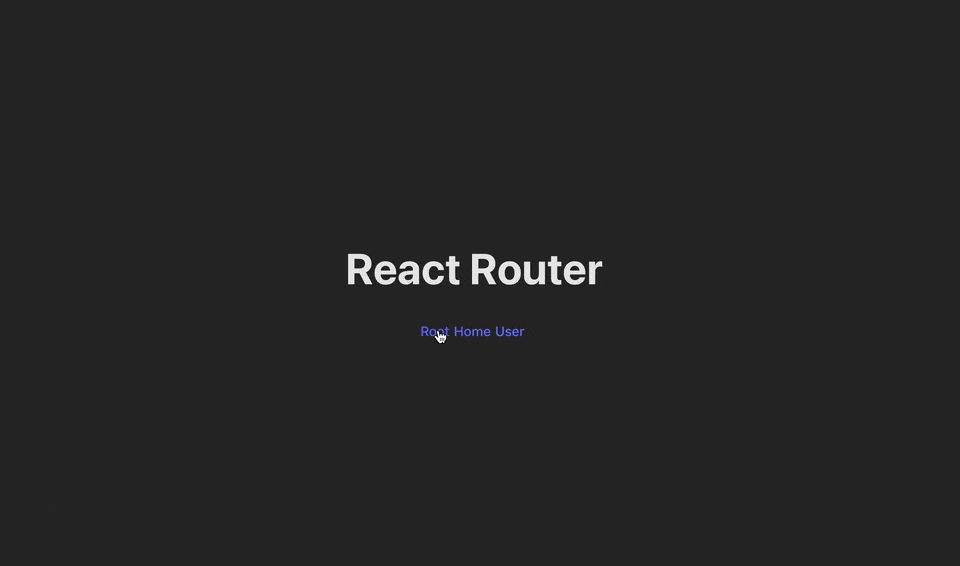

# Demo: Reactrouter with nested routes

Implementation of nested routes in reactrouter.

## Quick start

Should clone the project and after that using docker-compose command to start.

```bash
docker-compose up
```



## Definitions of `Layout.jsx` which is retranslate nested components

example with Outlet:

```jsx
import { Outlet } from "react-router-dom";

export let Layout = () => (
  <>
    <header>Navigation Menu</header>
    <Outlet /> - место, где будут отображаться дочерние маршруты
    <footer>Footer</footer>
  </>
);
```

example with children components:

```jsx
export let Layout = ({ children }) => (
  <>
    <header>Navigation Menu</header>
    {children} - место, где будут отображаться дочерние маршруты
    <footer>Footer</footer>
  </>
);

// дочерние элементы
export const Home = () => <h1>Home Page</h1>;
export const About = () => <h1>About Page</h1>;
```

Using (`Layout.jsx`)

```jsx
import React from "react";
import { BrowserRouter, Routes, Route } from "react-router-dom";
import { Layout, Home, About } from "componets";

const App = () => (
  <BrowserRouter>
    <Routes>
      <Route element={<Layout />}>
        <Route path="/home" element={<Home />} />
        <Route path="/about" element={<About />} />
      </Route>
    </Routes>
  </BrowserRouter>
);

export default App;
```
